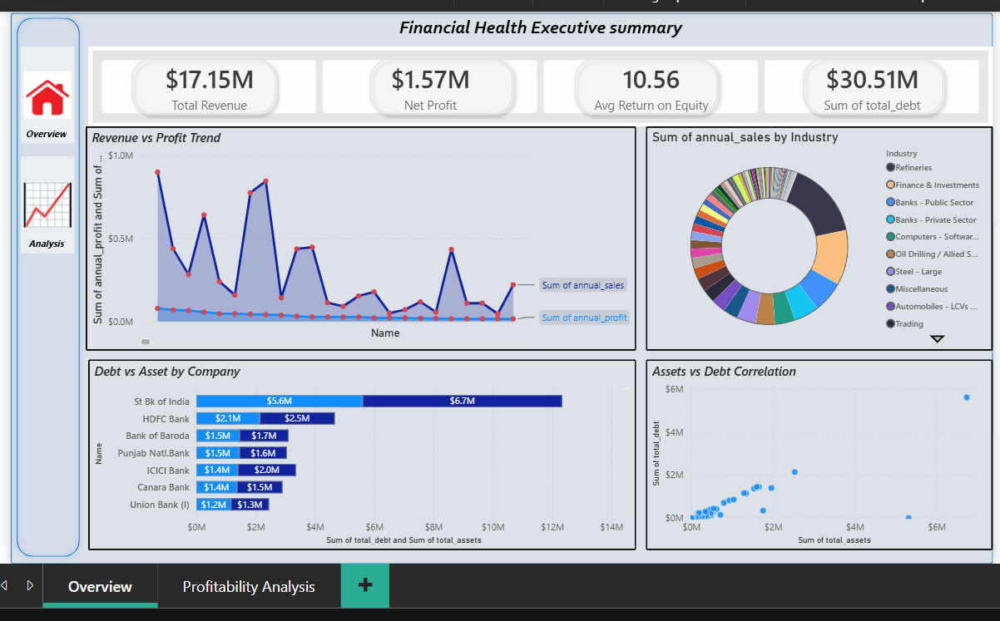

# Financial Performance & Profitability Analysis

An end-to-end finance analytics project: raw financial statements of **4,668 listed companies across 107 industries** are modelled in **PostgreSQL**, cleaned into a single analysis view, and visualised in a two-page **Power BI** dashboard covering profitability, returns, leverage and quarterly performance.

**Tools:** PostgreSQL 18 · pgAdmin 4 · SQL (multi-table joins, views, data cleaning) · Power BI Desktop

---

## Dashboard preview

**Overview – Financial Health Executive Summary**


**Profitability Analysis**


## Key findings

| Metric | Value |
|---|---|
| Companies / industries analysed | 4,668 / 107 |
| Total annual sales | 17.15M |
| Total annual net profit | 1.57M (aggregate net margin ≈ **9.2%**) |
| Largest industries by sales | Refineries (15.9%), Finance & Investments (11.3%), Public-sector banks (6.4%) |
| Most profitable large industry (net margin) | Private-sector banks ≈ 22%, Large software ≈ 15% |
| Loss-making companies | 1,008 (≈ **21.6%** of all companies) |
| Share of total "debt" held by banks | ≈ **70%** (bank debt includes customer deposits) |
| ROE – average vs median | 10.56 vs 6.62 (a few extreme outliers inflate the average) |

> Amounts are in the source dataset's reporting unit (Indian listed companies – typically ₹ crore).

## How the data flows

```
Raw CSVs (5 files) ──► PostgreSQL tables ──► dashboard_master view ──► Power BI
                       (sql/01, sql/02)      (sql/03)                   (dashboard/)
```

Five tables joined 1:1 on `join_key`: `annual_pl_1`, `balance_sheet`, `cash_flow`, `financial_ratios`, `quarterly_financials`.
All columns are first loaded as `TEXT`, then converted with the `to_num()` helper (removes thousand separators, blank → `NULL`).

## Repository structure

```
├── data/
│   └── cleaned_financial_master_data.csv   # export of the dashboard_master view (4,668 rows)
├── sql/
│   ├── 01_create_tables.sql                # schema for the 5 raw tables
│   ├── 02_load_data.sql                    # \copy commands + row-count check
│   ├── 03_views.sql                        # to_num() helper, final_health_data, dashboard_master
│   └── 04_analysis_queries.sql             # example business questions
├── dashboard/
│   └── financial_performance_profitability_analysis.pbix
├── images/                                 # dashboard + pgAdmin screenshots
└── README.md
```

## How to reproduce

1. Create a database and run `sql/01_create_tables.sql`.
2. Load the raw CSVs into `data/raw/` and run `sql/02_load_data.sql` (or use pgAdmin → Import/Export).
3. Run `sql/03_views.sql` to build `dashboard_master`.
4. Open the `.pbix` in Power BI Desktop (the data is embedded, so it opens without a database connection), or connect Power BI to the `dashboard_master` view / the cleaned CSV.

## Data dictionary – `dashboard_master`

| Column | Description |
|---|---|
| Name, Industry | Company and industry classification |
| annual_sales, annual_profit | Latest annual sales and net profit |
| latest_quarter_sales, latest_quarter_profit | Latest quarter sales and net profit |
| q_sales_growth_pct | Year-on-year quarterly sales growth (%) |
| total_assets, total_debt | Balance-sheet totals |
| roe | Return on equity (%) |
| stock_price | Current share price |

## Known limitations

- **Missing values in the CSV are shown as 0.** The exported CSV / Power BI model was built from an earlier version of the view that replaced `NULL` with `0`, so "not reported" and "true zero" cannot be told apart (e.g. 995 zero growth values, 659 zero-debt values). `sql/03_views.sql` keeps `NULL`s; re-export the view to fix the data.
- **Extreme outliers** (e.g. ROE of 13,100% for one micro-cap, quarterly sales growth above 300,000%) come from very small bases and distort averages – prefer the median or filter them.
- **Bank "debt" includes deposits**, so debt/asset comparisons should exclude banks or treat them separately.
- The dataset is a single snapshot, so there is no time-series trend.

## Data source

<!-- TODO: add the source of the dataset (website / provider) and the date it was downloaded -->
Source: _add the dataset source and download date here._

## Author

**Jawad Ahmad** – BBA Finance graduate
[LinkedIn](https://www.linkedin.com/public-profile/settings/?lipi=urn%3Ali%3Apage%3Ad_flagship3_profile_self_edit_contact_info%3BgFflSYtfQpiV6E1AKFgKqg%3D%3D)
